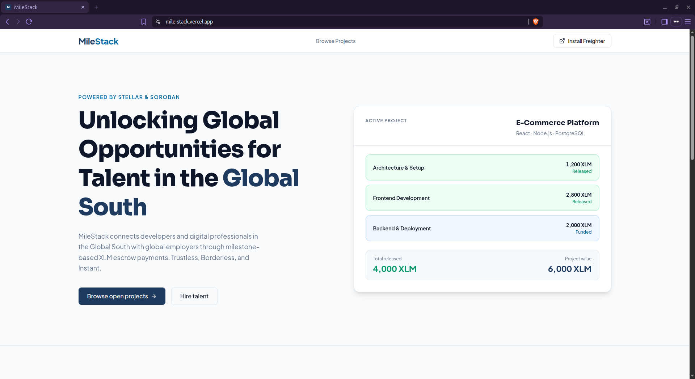

# MileStack

> A Soroban-powered talent marketplace enabling developers in the Global South to access global opportunities through milestone-based XLM escrow payments, transparent smart contracts, and borderless financial infrastructure.

Built on **Stellar** + **Soroban** for the hackathon.



---

## Table of Contents

- [Project Structure](#project-structure)
- [Tech Stack](#tech-stack)
- [Prerequisites](#prerequisites)
- [Getting Started](#getting-started)
- [Smart Contract](#smart-contract)
- [Frontend Setup](#frontend-setup)
- [Environment Variables](#environment-variables)
- [Deployed Contract](#deployed-contract)
- [Contributing](#contributing)

---

## Project Structure

```text
.
├── contracts/
│   └── mile-stack/
│       ├── src/
│       │   ├── lib.rs          # Contract entry point & function implementations
│       │   ├── types.rs        # Data types: MilestoneStatus, Milestone, Project, DataKey (+ Reputation)
│       │   ├── storage.rs      # Storage helpers: load/save project, update_milestone, get/increment_reputation
│       │   └── test/
│       │       ├── mod.rs              # Shared test helpers
│       │       ├── types.rs            # Data structure tests
│       │       ├── create_project.rs   # create_project tests
│       │       ├── fund_milestone.rs   # fund_milestone tests
│       │       ├── approve_milestone.rs
│       │       ├── dispute_milestone.rs
│       │       ├── mark_complete.rs    # mark_complete tests
│       │       ├── resolve_dispute.rs  # resolve_dispute + initialize tests
│       │       ├── view_functions.rs
│       │       ├── lifecycle.rs        # Auth guards + end-to-end lifecycle test
│       │       └── reputation.rs       # On-chain reputation score tests (4 tests)
│       └── Cargo.toml
├── mile-stack-frontend/        # Next.js 16 frontend
├── supabase/
│   └── migrations/             # SQL migration files
│       ├── 20260604000000_create_listings_and_applications.sql
│       ├── 20260604000001_create_project_metadata.sql
│       ├── 20260607000000_tighten_rls_policies.sql
│       └── 20260607000001_create_freelancer_profiles.sql
├── Cargo.toml
└── README.md
```

---

## Tech Stack

| Layer | Technology |
|-------|------------|
| Smart Contracts | Rust + Soroban SDK 25 |
| Blockchain | Stellar (Testnet) |
| Payments | XLM (native Stellar token) |
| Frontend | Next.js 16, Tailwind CSS v4, TypeScript |
| Wallet | Freighter browser extension |
| Database | Supabase (off-chain marketplace data) |

---

## Prerequisites

- [Git](https://git-scm.com/)
- [Rust](https://www.rust-lang.org/tools/install) (stable toolchain)
- [Stellar CLI](https://developers.stellar.org/docs/tools/developer-tools/stellar-cli)
- [Node.js](https://nodejs.org/) 18+
- [Freighter Wallet](https://www.freighter.app/) browser extension (for the demo)
- A free [Supabase](https://supabase.com) project

---

## Getting Started

### 1. Clone the repository

```bash
git clone https://github.com/johneliud/mile-stack.git
cd mile-stack
```

### 2. Run the contract tests

```bash
cargo test
```

Expected output:

```
running 54 tests
test test::approve_milestone::test_approve_milestone_records_client_auth ... ok
test test::approve_milestone::test_approve_milestone_rejects_already_released_milestone ... ok
test test::approve_milestone::test_approve_milestone_rejects_funded_milestone ... ok
test test::approve_milestone::test_approve_milestone_rejects_pending_milestone ... ok
test test::approve_milestone::test_approve_milestone_releases_xlm_to_freelancer ... ok
test test::approve_milestone::test_approve_milestone_updates_status_to_released ... ok
test test::create_project::test_create_project_persists_correctly ... ok
test test::create_project::test_create_project_rejects_empty_milestones ... ok
test test::create_project::test_create_project_rejects_mismatched_milestone_lengths ... ok
test test::create_project::test_create_project_requires_client_auth ... ok
test test::create_project::test_create_project_returns_incrementing_ids ... ok
test test::dispute_milestone::test_dispute_milestone_client_can_dispute ... ok
test test::dispute_milestone::test_dispute_milestone_does_not_affect_siblings ... ok
test test::dispute_milestone::test_dispute_milestone_freelancer_can_dispute ... ok
test test::dispute_milestone::test_dispute_milestone_locks_funds_in_contract ... ok
test test::dispute_milestone::test_dispute_milestone_records_caller_auth ... ok
test test::dispute_milestone::test_dispute_milestone_rejects_already_released_milestone ... ok
test test::dispute_milestone::test_dispute_milestone_rejects_pending_milestone ... ok
test test::dispute_milestone::test_dispute_milestone_rejects_unauthorized_caller ... ok
test test::fund_milestone::test_fund_milestone_records_client_auth ... ok
test test::fund_milestone::test_fund_milestone_rejects_already_funded_milestone ... ok
test test::fund_milestone::test_fund_milestone_transfers_xlm_to_contract ... ok
test test::fund_milestone::test_fund_milestone_updates_status_to_funded ... ok
test test::lifecycle::test_full_project_lifecycle ... ok
test test::lifecycle::test_only_client_can_approve ... ok
test test::lifecycle::test_only_client_can_fund ... ok
test test::mark_complete::test_mark_complete_auth_required ... ok
test test::mark_complete::test_mark_complete_does_not_affect_siblings ... ok
test test::mark_complete::test_mark_complete_rejects_non_freelancer ... ok
test test::mark_complete::test_mark_complete_rejects_pending_milestone ... ok
test test::mark_complete::test_mark_complete_records_freelancer_auth ... ok
test test::mark_complete::test_mark_complete_updates_status_to_completed ... ok
test test::reputation::test_reputation_accumulates_across_milestones ... ok
test test::reputation::test_reputation_increments_on_approve_milestone ... ok
test test::reputation::test_reputation_is_per_freelancer ... ok
test test::reputation::test_reputation_starts_at_zero ... ok
test test::resolve_dispute::test_initialize_double_init_rejected ... ok
test test::resolve_dispute::test_initialize_sets_resolver ... ok
test test::resolve_dispute::test_resolve_dispute_auth_required ... ok
test test::resolve_dispute::test_resolve_dispute_records_resolver_auth ... ok
test test::resolve_dispute::test_resolve_dispute_refunds_to_client ... ok
test test::resolve_dispute::test_resolve_dispute_rejects_funded_milestone ... ok
test test::resolve_dispute::test_resolve_dispute_rejects_non_resolver ... ok
test test::resolve_dispute::test_resolve_dispute_releases_to_freelancer ... ok
test test::types::test_initial_project_count_is_zero ... ok
test test::view_functions::test_get_milestone_panics_for_out_of_range_index ... ok
test test::view_functions::test_get_milestone_panics_for_unknown_project ... ok
test test::view_functions::test_get_milestone_returns_correct_fields ... ok
test test::view_functions::test_get_project_count_tracks_multiple_projects ... ok
test test::view_functions::test_get_project_panics_for_unknown_id ... ok
test test::view_functions::test_get_project_returns_correct_fields ... ok
test test::view_functions::test_view_functions_do_not_require_auth ... ok

test result: ok. 54 passed; 0 failed
```

### 3. Build the contract

```bash
stellar contract build
```

Output:

```
target/wasm32v1-none/release/mile_stack.wasm
```

### 4. Deploy to Stellar Testnet

Generate and fund a deployer account (skip if the `milestack-deployer` key already exists):

```bash
stellar keys generate milestack-deployer --network testnet
stellar keys fund milestack-deployer --network testnet
```

Deploy the contract:

```bash
stellar contract deploy \
  --wasm target/wasm32v1-none/release/mile_stack.wasm \
  --source milestack-deployer \
  --network testnet
```

The contract ID printed to stdout is your `NEXT_PUBLIC_CONTRACT_ID`.

### 5. Initialize the contract (required after every deploy)

The contract must be initialized once to set the dispute resolver address. Use the deployer's public key (or any trusted admin account):

```bash
stellar contract invoke \
  --id <CONTRACT_ID> \
  --source milestack-deployer \
  --network testnet \
  -- initialize \
  --resolver <RESOLVER_ADDRESS>
```

Replace `<CONTRACT_ID>` with the ID from the previous step and `<RESOLVER_ADDRESS>` with the admin's Stellar public key. This call can only succeed once - any subsequent call will panic.

---

## Smart Contract

### Milestone Lifecycle

```
Pending → Funded → Completed → Released
                ↘ Disputed ──────────────→ Released (via resolver)
```

The freelancer calls `mark_complete` after finishing work on a `Funded` milestone. Only then can the client call `approve_milestone` to release payment. Either party can call `dispute_milestone` at any time while funds are escrowed; a designated resolver account settles the dispute by calling `resolve_dispute`.

### Data Types

| Type | Description |
|------|-------------|
| `MilestoneStatus` | `Pending` → `Funded` → `Completed` → `Released` or `Disputed` |
| `Milestone` | Title, XLM amount, status, freelancer address |
| `Project` | ID, client address, milestone list, creation timestamp |
| `DataKey` | Storage keys: `Project(id)`, `ProjectCount`, `Resolver`, `Reputation(address)` |

### Contract Functions

| Function | Auth | Description |
|----------|------|-------------|
| `initialize(resolver)` | Deployer (one-time) | Sets the dispute resolver address; panics if called again |
| `create_project(client, freelancer, titles, amounts)` | Client | Creates a new escrow project; returns project ID |
| `fund_milestone(project_id, milestone_index, token)` | Client | Locks milestone XLM in contract escrow (must be `Pending`) |
| `mark_complete(caller, project_id, milestone_index)` | Freelancer | Signals work is done; transitions `Funded` → `Completed` |
| `approve_milestone(project_id, milestone_index, token)` | Client | Releases escrowed XLM to the freelancer; increments the freelancer's on-chain reputation score |
| `dispute_milestone(caller, project_id, milestone_index)` | Client or Freelancer | Flags milestone as `Disputed`, funds stay locked |
| `resolve_dispute(caller, project_id, milestone_index, token, release_to_freelancer)` | Resolver | Settles a `Disputed` milestone - pays winner, marks `Released` |
| `get_project_count()` | None | Returns total number of projects |
| `get_project(project_id)` | None | Fetch a full project by ID |
| `get_milestone(project_id, milestone_index)` | None | Fetch a single milestone |
| `get_reputation(freelancer)` | None | Returns the number of milestones successfully approved for the given address |

---

## Frontend Setup

```bash
cd mile-stack-frontend

# Install dependencies
npm install

# Copy environment variables
cp .env.example .env.local
# Fill in values - see Environment Variables section below

# Start the development server
npm run dev

# Seed 10 demo listings into Supabase (requires DEMO_CLIENT_ADDRESS in .env.local)
npm run seed

# Run the headless E2E integration test (funds accounts via Friendbot, exercises the full flow)
npm run test:e2e
```

Open [http://localhost:3000](http://localhost:3000).

On first use, connect your Freighter wallet and select your role (**I want to hire** or **I want to work**). The role is saved in `localStorage` and determines your navigation, dashboard, and landing page CTAs. You can switch roles at any time via the role chip in the navbar.

See [`mile-stack-frontend/README.md`](./mile-stack-frontend/README.md) for full frontend documentation including Supabase setup.

---

## Environment Variables

Create `.env.local` inside `mile-stack-frontend/` using `.env.example` as a template:

| Variable | Value / Description |
|----------|---------------------|
| `NEXT_PUBLIC_STELLAR_RPC_URL` | `https://soroban-testnet.stellar.org` |
| `NEXT_PUBLIC_CONTRACT_ID` | `CAGH37UE6W66FDEI7HPWLGMSWQD4Z7SRZVW3AJLBVL6CUN47UYRUBIFN` |
| `NEXT_PUBLIC_NETWORK_PASSPHRASE` | `Test SDF Network ; September 2015` |
| `NEXT_PUBLIC_XLM_TOKEN_ID` | `CDLZFC3SYJYDZT7K67VZ75HPJVIEUVNIXF47ZG2FB2RMQQVU2HHGCYSC` |
| `NEXT_PUBLIC_SIMULATION_SOURCE` | A funded testnet account public key (for read-only contract simulations) |
| `NEXT_PUBLIC_SUPABASE_URL` | Your Supabase project URL (Project Settings > API) |
| `NEXT_PUBLIC_SUPABASE_ANON_KEY` | Your Supabase anon/public key (Project Settings > API) |
| `DEMO_CLIENT_ADDRESS` | Client public key used by `npm run seed` to author demo listings |
| `INTEGRATION_CLIENT_SECRET` | *(optional)* Persistent testnet secret for the E2E test client account; leave blank to auto-generate via Friendbot |
| `INTEGRATION_FREELANCER_SECRET` | *(optional)* Persistent testnet secret for the E2E test freelancer account |

---

## Demo Accounts

Pre-created and funded testnet accounts for testing and live demos. Testnet only - no real value.

| Role | Public Key | Secret Key |
|------|-----------|------------|
| Client | `GBRDKWQ4RB4JNIB3JUJXXNC2D4SAPUILUPLJAQIUVOLDYQYSHOHYOFMX` | `SBPC4PYKLSCQVYA3HBDTLDFPCMKVQ4B6YQV3X2QFPOKPG5ZWDNOBCTBW` |
| Freelancer | `GCJTJMXZ43MF6W5SJVWOOJKPFCP7K4AURSBNLTTMWNABMU6T4DW2ERHF` | `SBMGNNTQRHV2KIARRXKJRPZU35VBJFMWAEJTJNPOJ52SRIWWSD3AHQEY` |

Import each secret key into Freighter (set to Testnet), then run `npm run seed` inside `mile-stack-frontend/` to populate the demo listing. See [`docs/DEMO.md`](./docs/DEMO.md) for the full walkthrough.

---

## Deployed Contract

| Network | Contract ID |
|---------|-------------|
| Testnet | [`CAGH37UE6W66FDEI7HPWLGMSWQD4Z7SRZVW3AJLBVL6CUN47UYRUBIFN`](https://stellar.expert/explorer/testnet/contract/CAGH37UE6W66FDEI7HPWLGMSWQD4Z7SRZVW3AJLBVL6CUN47UYRUBIFN) |

**Deployer / Resolver:** `GCQQCRKG3C5DPPWTVTYYWEJLIPHUVBKQYT6HIOBX7I37UVSY7DNMNFZR`

**Deploy transaction:** [`b5b91f2f43f746a0d08d741450af7a92747ee5f8f837ac3c96605033b3c4b8ff`](https://stellar.expert/explorer/testnet/tx/b5b91f2f43f746a0d08d741450af7a92747ee5f8f837ac3c96605033b3c4b8ff)

**Initialize transaction:** [`ea7bde1d6446dde399714c79e35027ca3bcb5ac3be77388adace8c5981365690`](https://stellar.expert/explorer/testnet/tx/ea7bde1d6446dde399714c79e35027ca3bcb5ac3be77388adace8c5981365690)

**Native XLM token (testnet):** `CDLZFC3SYJYDZT7K67VZ75HPJVIEUVNIXF47ZG2FB2RMQQVU2HHGCYSC`

---

## Contributing

1. Pick an open issue from the [issue tracker](https://github.com/johneliud/mile-stack/issues)
2. Create a branch: `git checkout -b feat/<issue-number>-short-description`
3. Make your changes and ensure tests pass: `cargo test`
4. Open a PR referencing the issue with `Closes #<issue-number>`
